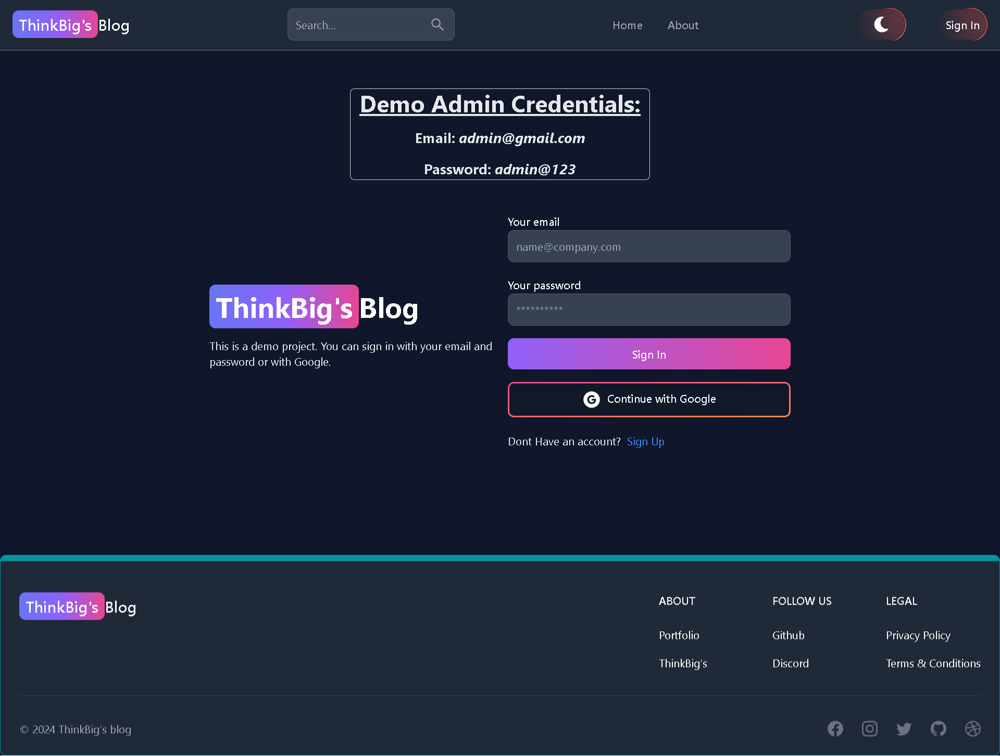

# ThinkBig's Blog Web Application

This Blog Web Application allows admins to manage blog posts and user comments, while users can read, comment on blogs, and manage their profiles. The application supports Google Authentication and traditional credential-based authentication.

## Features

### Admin Features:
- **Add, Update, and Delete Blogs:** Admins can create new blog posts, update existing ones, and delete blogs.
- **Manage Comments:** Admins can edit and delete any comments left by users on blog posts.
- **User Management:** Admins have the ability to delete user accounts.

### User Features:
- **Read Blogs:** Users can browse and read published blog posts.
- **Comment on Blogs:** After authenticating, users can leave comments on blog posts.
- **Edit and Delete Own Comments:** Users can edit or delete their comments on blog posts.
- **Profile Management:** Users can update their profile picture, name, user ID, and password.
- **Search:** Users can search with titel of blog post.

## Authentication
- **Google Authentication:** Users can log in using their Google account.
- **Traditional Credentials:** Users can also create an account using their email and password.

## Tech Stack

- **Frontend:** React.js, Tailwind CSS / Material-UI
- **Backend:** Express.js, Node.js
- **Database:** MongoDB / MySQL (based on preference)
- **Authentication:** Passport.js for Google OAuth and traditional login
- **ORM:** Prisma ORM (for MySQL setup) or Mongoose (for MongoDB setup)
- **State Management:** Redux (for managing global state)

## Installation

1. Clone the repository:
    ```bash
    git clone https://github.com/Chandan8018/ChandanBlog.git
    cd blog-web-app
    ```

2. Install dependencies:
    ```bash
    npm install
    ```

3. Set up environment variables:
    - Create a `.env` file in the root directory.
    - Add the following variables:
      ```env
      PORT=3000
      DB_URL=mongodb://localhost:27017/blogwebapp
      SESSION_SECRET=your-session-secret
      ```

4. Run the application:
    ```bash
    npm run dev
    ```

5. Visit `http://localhost:3000` in your browser to access the application.

## Usage

### Admin Panel
- Accessible to users with admin privileges.
- Manage blogs and user comments directly from the admin dashboard.

### User Dashboard
- Users can view and update their profile.
- Users can manage their comments on blog posts.

### Blog Viewing
- Any authenticated user can view blogs and leave comments.

## API Endpoints

### Authentication
- `api/auth/google`: Google OAuth authentication.
- `api/auth/login`: Traditional email and password login.
- `api/auth/signup`: User registration.

### Blog Management (Admin)
- `POST /api/post/create`: Create a new blog.
- `GET /api/post/getposts`: Get all blogs post.
- `PUT /api/post/updatepost/:postId/:userId`: Update an existing blog.
- `DELETE /api/post/deletepost/:postId/:userId`: Delete a blog.

### Comment Management
- `POST /api/comment/create`: Add a comment to a blog.
- `GET /api/comment/getPostComments/:postId`: Get all post comment on array.
- `PUT /api/comment/editComment/:commentId`: Edit a comment.
- `PUT /api/comment/likeComment/:commentId`: Likes comment.
- `DELETE /api/comment/deleteComment/:commentId`: Delete a comment.

### User Management
- `GET /api/user`: Fetch user details.
- `PUT /api/user/update/:userId`: Update user profile.
- `DELETE /api/user/delete/:userId`: Delete user.
- `POST /api/user/signout`: SignOut User.

## Demo

- Home Page

---
- Sign-Up Page

---
- Sign-In Page

---
- Admin Dashboard Page

---
- User Profile Page

---
- Blogs Page

---
- Create Blog Page

---
- Users Page

---
- Comments Page

---
## Contributing

1. Fork the repository.
2. Create a new branch (`git checkout -b feature/your-feature-name`).
3. Commit your changes (`git commit -m 'Add some feature'`).
4. Push to the branch (`git push origin feature/your-feature-name`).
5. Open a Pull Request.

## License

This project is licensed under the MIT License - see the [LICENSE](LICENSE) file for details.

## Contact

For further inquiries, feel free to reach out to me at [chandankumarsahoo19@gmail.com](mailto:chandankumarsahoo19@gmail.com).
